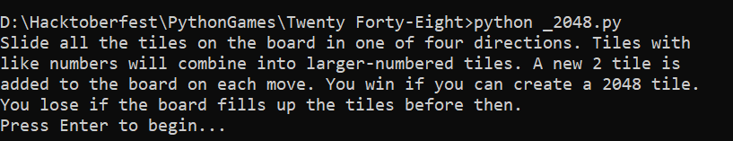
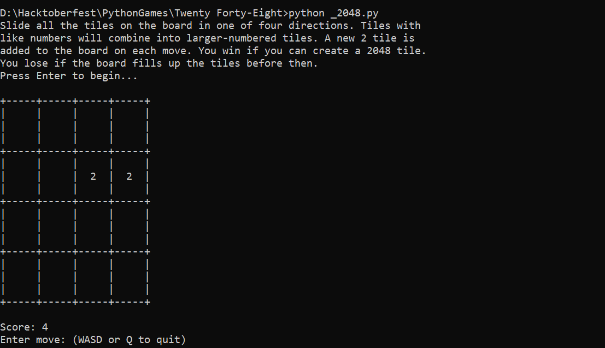
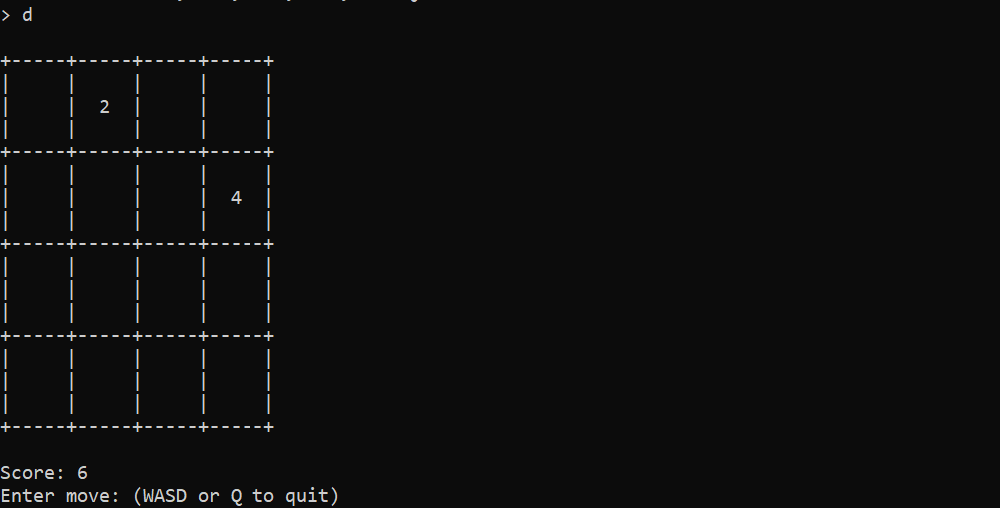

# About

2048 is a single-player sliding tile puzzle video game written by Italian web developer Gabriele Cirulli and published on GitHub. The game has simple and straightforward mechanics and dynamics, that are easy to understand and get around. The objective is to slide numbered tiles on a grid to combine them to create a tile with the number 2048.

## Libraries Used

* random
* sys

## Run Locally

Clone the project

```bash
  git clone https://github.com/rootanand/PythonGames.git
```

## Change directory

```bash
cd PythonGames\Twenty Forty-Eight
```

Run the  `_2048.py` file.

```python
python _2048.py
```



Press Enter to launch the game. Use `WASD` keys to slide the board or `Q` to quit.




